# Platform as a service(PaaS) Examples

## [GCP App Engine](https://cloud.google.com/appengine)

### [GCP SDK](https://cloud.google.com/sdk)

###  YAML File
```bash
  runtime: nodejs16
```

###  Deploy Command
```bash
  gcloud app deploy
```
## Images
### Choose region
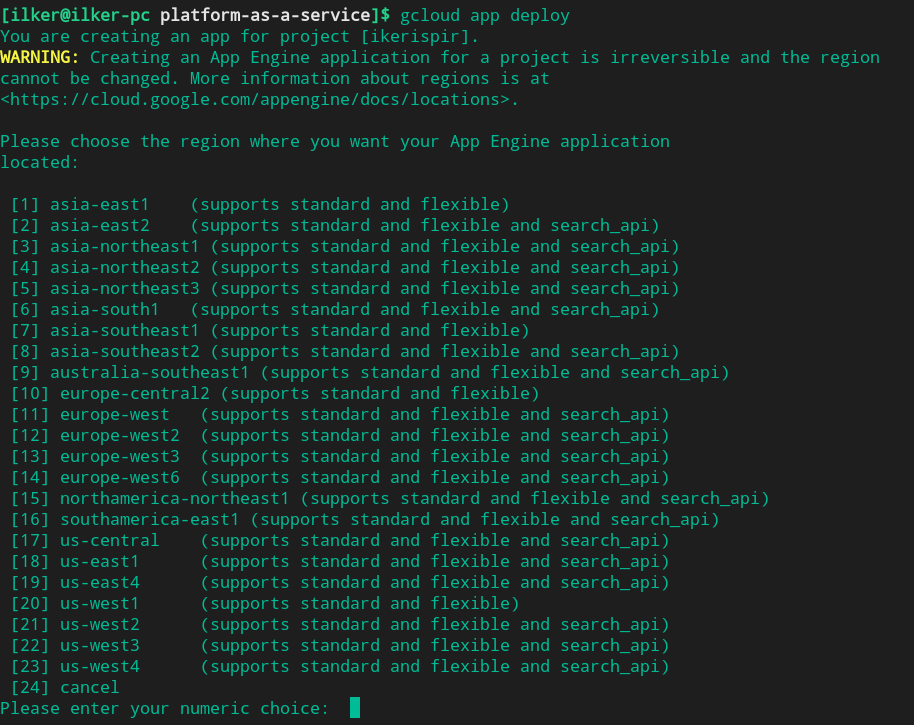

### Approve
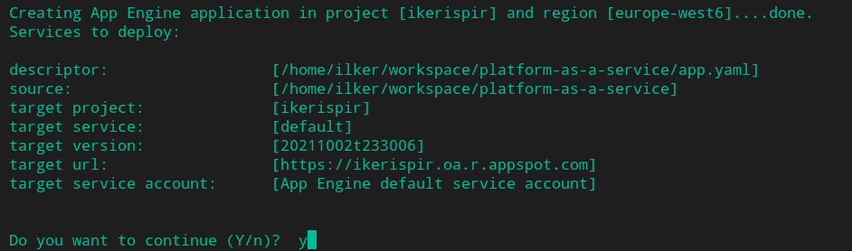

### Completed
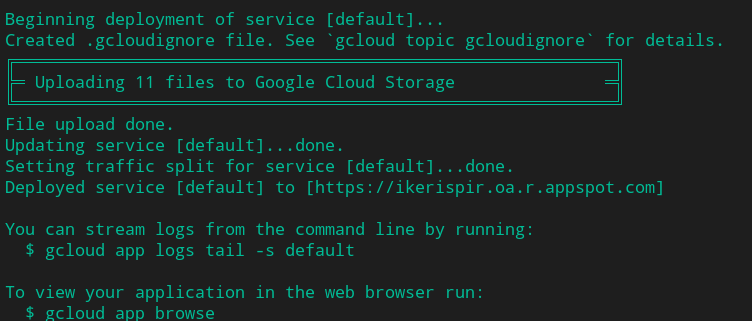

### Prove
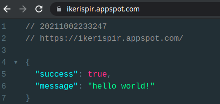

### GCP Console Interface
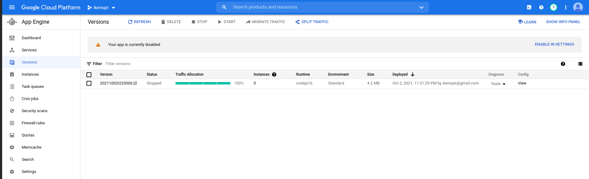

## [AWS Elastic Beanstalk](https://aws.amazon.com/elasticbeanstalk/)

### [AWS EB CLI](https://docs.aws.amazon.com/elasticbeanstalk/latest/dg/eb-cli3-install.html)

###  Deploy Command
```bash
  eb create my-app
```
## Images
### Deploy
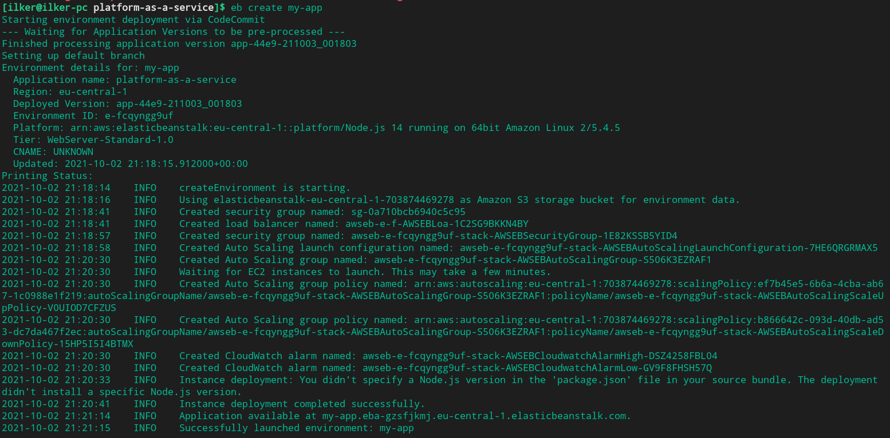

### Prove
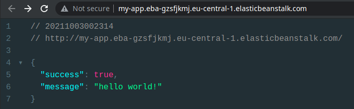

### Aws Console Interface
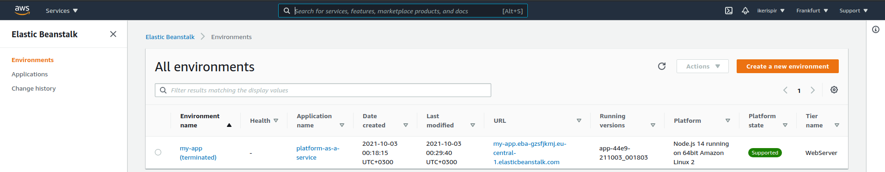

## [Azue App Service](https://azure.microsoft.com/en-us/services/app-service/)

### [Azure CLI](https://docs.microsoft.com/en-us/cli/azure/)

###  Deploy Command
```bash
  az webapp up --name ilker
```
## Images
### Deploy
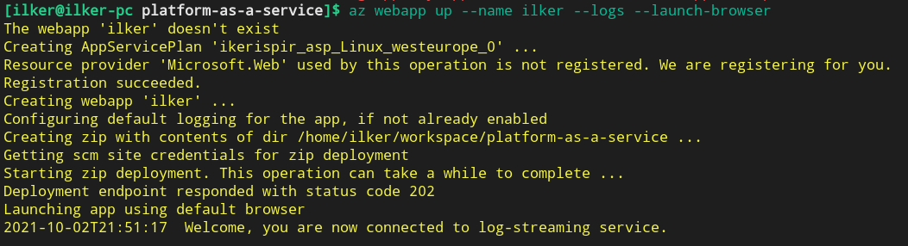

### Prove
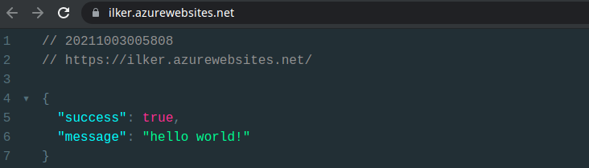

### Azure Console Interface
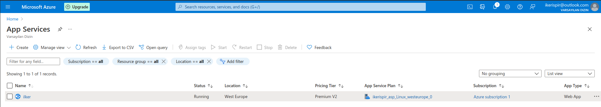

## [Heroku](https://www.heroku.com/)

### [Heroku CLI](https://devcenter.heroku.com/articles/heroku-cli)

###  Procfile File
```bash
  web: npm start
```
###  Deploy Command
```bash
  az webapp up --name ilker
```
## Images
### Deploy


### Prove


### Azure Console Interface


## Authors

- [@ilkerispir](https://www.github.com/ilkerispir)